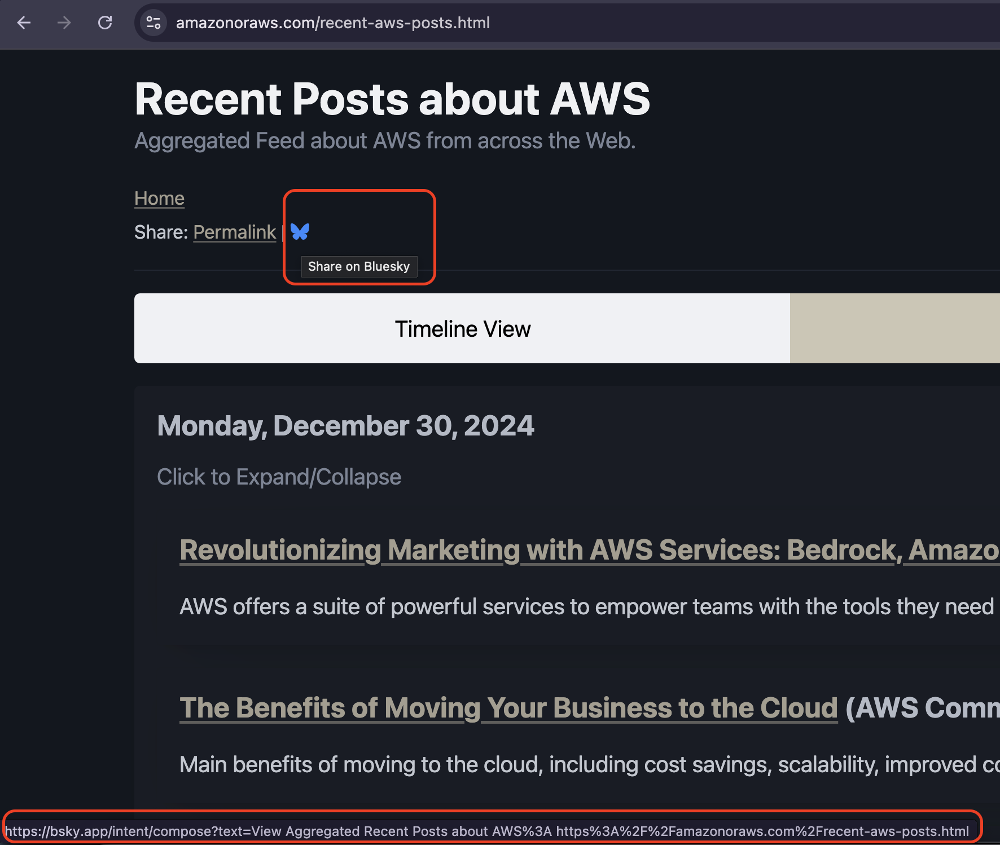
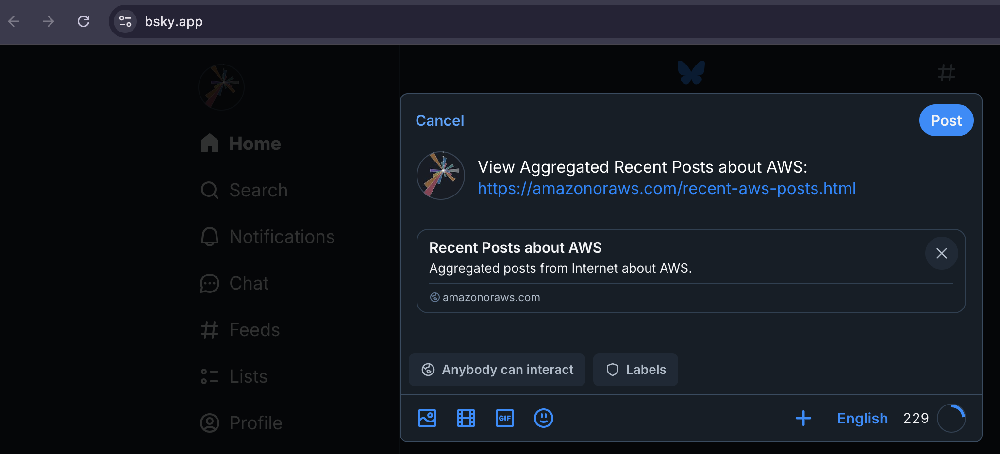

= Share on Bluesky using Bluesky Icon from Font Awesome

I recently read `How to Add 'Share on Bluesky' Action Intent Button to Your Website` here: https://www.pietschsoft.com/post/2024/11/22/how-to-add-share-on-bluesky-action-intent-button-to-your-website

I promptly decided to try it out on my site https://amazonoraws.com[amazonoraws.com]. See the final result here: https://amazonoraws.com/recent-aws-posts.html[amazonoraws.com/recent-aws-posts.html]

Here are the steps.

* I added the following javascript function.
[source:javascript]
----
function setBlueskyShareUrl(postText, link, hrefId) {
    const elem = document.getElementById(hrefId);
    if (elem) {
        const encodedText = encodeURIComponent(postText);
        const encodedLink = encodeURIComponent(link);
        const blueskyUrl = `https://bsky.app/intent/compose?text=${encodedText}%20${encodedLink}`;
        elem.href = blueskyUrl;
    }
}

setBlueskyShareUrl("View Aggregated Recent Posts about AWS:", window.location.href, "bluesky-share-button");
----

* I added the following two lines to import the Bluesky icon on the page.

----
<link rel="stylesheet" href="fonts/fontawesome-free-6.7.2-web/css/all.css">
<link rel="stylesheet" href="fonts/fontawesome-free-6.7.2-web/css/brands.css">
----

* I added a corresponding anchor tag on the html page.
[source:html]
----
<a id="bluesky-share-button" rel="nofollow" href="#" target="_blank" title="Share on Bluesky">
    <i class="fa-brands fa-bluesky" style="color: #3a88fe;"></i>
</a>
----

And that is it.

Additional Reference: https://docs.bsky.app/docs/advanced-guides/intent-links[Bluesky Intent Links Documentation]