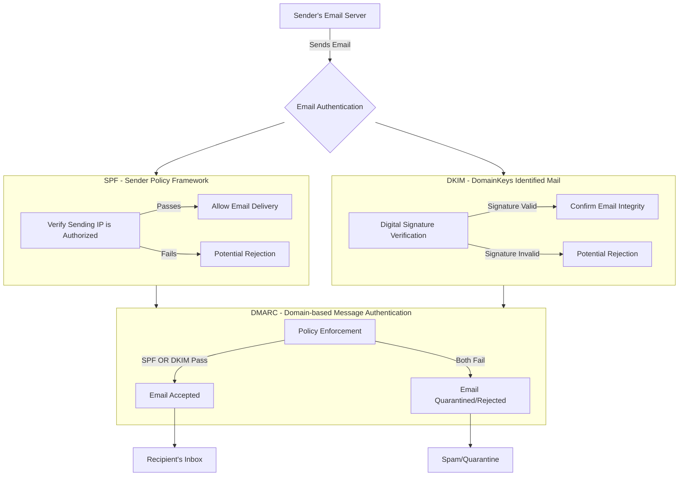
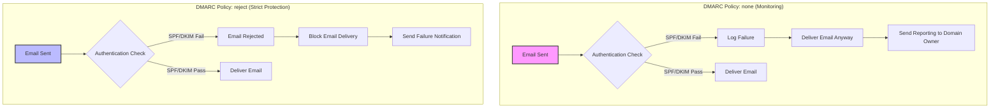

= Email Delivery - SPF, DKIM, and DMARC

== What are SPF, DKIM, and DMARC and how are they useful?

Here is what Claude tells me how SPF, DKIM, and DMARC work together to keep a healthy email delivery system.

1. **SPF (Sender Policy Framework)**:
    - Checks if the email is sent from an IP address authorized by the domain's DNS records
    - Helps prevent email spoofing by verifying sender's origin

2. **DKIM (DomainKeys Identified Mail)**:
    - Adds a digital signature to the email
    - Ensures the email wasn't tampered with during transmission
    - Provides cryptographic proof of the sender's identity

3. **DMARC (Domain-based Message Authentication, Reporting, and Conformance)**:
    - Acts as an umbrella policy that combines SPF and DKIM
    - Defines what happens if an email fails authentication
    - Can quarantine or reject emails that don't meet authentication criteria

The flow shows how an email goes through these three layers of authentication before reaching the recipient's inbox. If the email passes at least one of SPF or DKIM and meets DMARC policy, it's delivered. Otherwise, it may be rejected or sent to spam.



== What behaviors can be influenced by various DMARC settings?

Here are a couple of variations showing how the email server's behavior differs when DMARC is set to `none` versus when DMARC is set to `reject`.



Here is a breakdown of the key differences:

**DMARC Policy: none**
- Primarily used for monitoring and gathering data
- Emails are delivered regardless of authentication status
- Failures are logged and reported to the domain owner
- Low-risk approach for understanding email traffic
- Useful during initial implementation to understand potential issues

**DMARC Policy: reject**
- Provides maximum protection against email spoofing
- Emails that fail authentication are completely blocked
- No unauthorized emails reach the recipient's inbox
- Requires high confidence in your SPF and DKIM configurations
- Recommended for organizations with strict security requirements

The progression typically goes:
1. Start with "none" policy to monitor
2. Move to "quarantine" policy (not shown in this diagram)
3. Eventually implement "reject" policy when confident in email authentication setup

== Explore

We can use the `dig` command in terminal to look at DMARC configuration of a public DNS:

```bash
dig +short _dmarc.example.com TXT
```

Additionally, there are some online DNS lookup tools like:
- mxtoolbox.com/SuperTool.aspx
- dmarcian.com/dmarc-inspector/
- google.com/admin/dns/lookup

Typically, expect to see a TXT record like this:
```
"v=DMARC1; p=reject; rua=mailto:dmarc-reports@example.com"
```

The key parameters in this record show:
- p: policy (none/quarantine/reject)
- rua: where aggregate reports are sent
- pct: percentage of messages subject to filtering
- sp: subdomain policy

