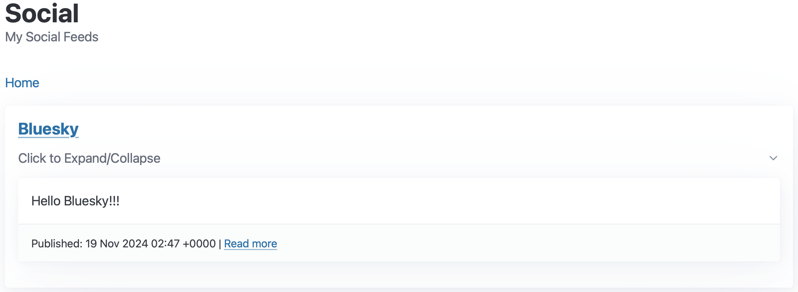

= Bluesky RSS Feed

TIL that Bluesky has a RSS Feed of a user's post.

Go to a user's profile, and then append `/rss` to view a feed.

For example, to view my Bluesky feed, go to my profile, `https://bsky.app/profile/psumiya.bsky.social` and then append `/rss`, such that the final link is `https://bsky.app/profile/psumiya.bsky.social/rss`. Entering that in a browser (Chrome) shows the RSS Feed.

Note that Bluesky redirects it to a different identifier that is associated to your identity, this is how it looks for my profile: `https://bsky.app/profile/did:plc:zzx2jxijrnytskb3pxq7csxw/rss`

== Show RSS Feed on my Blog

I used the above information to integrate my personal blog to show my Bluesky posts.

I had already integrated my Mastodon posts a few weeks back (see link:rss-to-html-using-xslt.adoc[RSS to HTML using XSLT]), I proceeded to use a similar setup.

Due to CORS, I needed to setup a background fetch and refresh of my Bluesky posts. So I setup a Lambda that runs every hour and refreshes my Bluesky RSS feed and writes it to S3. I use the S3 file to render the posts on my blog. Here is how I had done something similar for link:https://sumiya.page/amazonoraws-feature-updates-nov-2024.html#_behind_the_scenes[amazonoraws.com RSS/Atom rendering].

I used my link:https://github.com/psumiya/s3-uploader/blob/main/infrastructure/template.yaml[S3 Uploader] template to setup an EventBridge cron that triggers a lambda and writes latest Bluesky RSS feed to S3.

My social feed with above setup is available at link:https://sumiya.page/social.html[https://sumiya.page/social.html].

== Code Snippets

=== S3 Uploader/Refresher Lambda

[source:yaml]
-----
AWSTemplateFormatVersion: '2010-09-09'
Transform: AWS::Serverless-2016-10-31
Description: SAM template for scheduled Lambda with S3 write permissions

Parameters:
  SourceUrl:
    Type: String
    Description: URL of the content to fetch

  ContentType:
    Type: String
    Description: Content-Type pf the content, such as application/json

  S3BucketName:
    Type: String
    Description: Name of the S3 bucket where the fetched content will be stored

  S3KeyName:
    Type: String
    Description: Key (file path) where the fetched content will be stored in S3

Resources:
  ScheduledLambdaFunction:
    Type: AWS::Serverless::Function
    Properties:
      FunctionName: !Sub ${AWS::StackName}-scheduled-lambda-function
      Description: 'Scheduled Lambda to read from a given Source and write response to S3.'
      Handler: sumiya.LambdaHandler::handleRequest
      Runtime: java21
      Architectures:
        - arm64
      CodeUri: ../build/distributions/s3-uploader-1.0-SNAPSHOT.zip
      MemorySize: 512
      Timeout: 30
      Environment: # More info about Env Vars: https://github.com/awslabs/serverless-application-model/blob/master/versions/2016-10-31.md#environment-object
        Variables:
          SOURCE_URL: !Ref SourceUrl
          CONTENT_TYPE: !Ref ContentType
          S3_DESTINATION_BUCKET: !Ref S3BucketName
          S3_DESTINATION_KEY: !Ref S3KeyName
          JAVA_TOOL_OPTIONS: -XX:+TieredCompilation -XX:TieredStopAtLevel=1 # More info about tiered compilation https://aws.amazon.com/blogs/compute/optimizing-aws-lambda-function-performance-for-java/
      Events:
        ScheduleEvent:
          Type: Schedule
          Properties:
            Schedule: rate(1 hour)
            Name: !Sub ${AWS::StackName}-DailySchedule
            Description: Triggers lambda function daily
            Enabled: true
      Policies:
        - S3WritePolicy:
            BucketName: !Ref S3BucketName

  LambdaLogGroup:
    Type: AWS::Logs::LogGroup
    Properties:
      LogGroupName: !Sub /aws/lambda/${ScheduledLambdaFunction}
      RetentionInDays: 30

Outputs:
  LambdaFunctionArn:
    Description: ARN of the Lambda function
    Value: !GetAtt ScheduledLambdaFunction.Arn
  LambdaFunctionName:
    Description: Name of the Lambda function
    Value: !Ref ScheduledLambdaFunction
-----

=== XSL Transform File

[source:xml]
-----
<?xml version="1.0" encoding="UTF-8"?>
<xsl:stylesheet version="1.0"
                xmlns:xsl="http://www.w3.org/1999/XSL/Transform">
    <xsl:output method="html" encoding="UTF-8" indent="yes" />

    <xsl:template match="/">
        <xsl:apply-templates select="//item"/>
    </xsl:template>

    <xsl:template match="item">
        <article id="article">
            <xsl:if test="description">
                <xsl:value-of select="description" disable-output-escaping="yes"/>
            </xsl:if>

            <xsl:if test="pubDate">
                <footer>
                    <small>
                        Published: <xsl:value-of select="pubDate"/>
                        <xsl:if test="link">
                            | <a>
                                <xsl:attribute name="href">
                                    <xsl:value-of select="link"/>
                                </xsl:attribute>
                                Read more
                            </a>
                        </xsl:if>
                    </small>
                </footer>
            </xsl:if>
        </article>
    </xsl:template>
</xsl:stylesheet>
-----

=== Javascript

[source:javascript]
-----
// Globals
const parser = new window.DOMParser();

const fetchTextResponse = (response) => {
  if (!response.ok) {
      throw new Error(`Failed to fetch: ${response.status} ${response.statusText}`);
  }
  return response.text();
}

const getXmlResponse = async (url) => {
  const response = await fetchTextResponse(await fetch(url));
  return parser.parseFromString(response, "text/xml");
}

const getRssProcessor = async () => {
  const xsl = await getXmlResponse("rss-feed.xsl");
  const xsltProcessor = new XSLTProcessor();
  xsltProcessor.importStylesheet(xsl);
  return xsltProcessor;
}

const loadFeed = async (resultDocument, htmlId) => {
  if (resultDocument) {
      const container = document.getElementById(htmlId);
      if (container) {
          container.appendChild(resultDocument);
      } else {
          console.error(`Container element with id "${htmlId}" not found`);
      }
  } else {
      console.error('XSLT transformation failed to produce a result.');
  }
}

const MASTODON_HTML_ID = "mastodon";
const BLUESKY_HTML_ID = "bluesky";

const feedSourceMap = new Map();
feedSourceMap.set(MASTODON_HTML_ID, "https://hachyderm.io/@sumiya.rss");
feedSourceMap.set(BLUESKY_HTML_ID, "bluesky.rss");

class Feed {
    constructor(htmlId, content, processor) {
      this.htmlId = htmlId;
      this.content = content;
      this.processor = processor;
    }
}

async function loadAllFeeds() {
  try {
      // Parallel Fetch All Processors
      const [rssProcessor] = await Promise.all([
          getRssProcessor()
      ]);
      // Parallel Fetch All Feeds
      const [mastodonFeed, blueskyFeed] = await Promise.all([
          getXmlResponse(feedSourceMap.get(MASTODON_HTML_ID)),
          getXmlResponse(feedSourceMap.get(BLUESKY_HTML_ID))
      ]);
      // Render Feeds
      const feedDestinationSet = new Set([
          new Feed(MASTODON_HTML_ID, mastodonFeed, rssProcessor),
          new Feed(BLUESKY_HTML_ID, blueskyFeed, rssProcessor)
      ]);
      for (const feed of feedDestinationSet) {
          loadFeed(feed.processor.transformToFragment(feed.content, document), feed.htmlId);
      }
  } catch (error) {
      console.error('Error processing RSS feed:', error);
  }
}

loadAllFeeds();
-----

=== HTML

[source:html]
-----
<!DOCTYPE html>
<html lang="en-US" data-theme="light">

<head>
    <meta charset="utf-8" />
    <meta name="viewport" content="width=device-width" />
    <title>Social Feed</title>

    <link rel="apple-touch-icon" sizes="180x180" href="/apple-touch-icon.png">
    <link rel="icon" type="image/png" sizes="32x32" href="/favicon-32x32.png">
    <link rel="icon" type="image/png" sizes="16x16" href="/favicon-16x16.png">
    <link rel="manifest" href="/site.webmanifest">
    <link rel="stylesheet" href="assets/css/picocss/pico.classless.min.css">
</head>

<body>
    <main class="container">
        <header>
            <hgroup>
                <h1>Social</h1>
                
My Social Feeds

            </hgroup>
            <nav>
                <ul>
                    <li><a href="index.html">Home</a></li>
                </ul>
            </nav>
        </header>
        

            <article>
                <h4><a href="https://bsky.app/profile/psumiya.bsky.social">Bluesky</a></h4>
                

                    
Click to Expand/Collapse

                    <section id="bluesky"></section>
                

            </article>
            <article>
                <h4><a href="https://hachyderm.io/@sumiya">Mastodon</a></h4>
                

                    
Click to Expand/Collapse

                    <section id="mastodon"></section>
                

            </article>
        

    </main>
</body>

</html>
-----