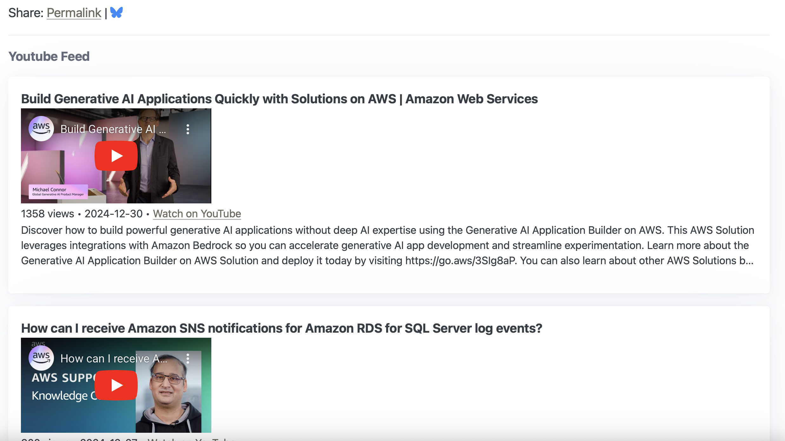

= Show Youtube Videos on a Webpage

== tl;dr

I added AWS YouTube Channel's Feed to my site link:https://amazonoraws.com/[amazonoraws.com].

== Details

Did you know that YouTube has a RSS feed for its channels?

I could not find any official docs for it, so it may be an observed behavior rather than an officially supported feature.

Anyway, here is how you can get an RSS Feed of a YouTube channel.

* Find the channelId you want to view videos of
* Append channel id as show here:
https://www.youtube.com/feeds/videos.xml?channel_id=TheChannelId

For example, here is a link to the Marques Brownlee YouTube Channel RSS Feed: https://www.youtube.com/feeds/videos.xml?channel_id=UCBJycsmduvYEL83R_U4JriQ

To find a channel's id:

* I went to the Channel, for example, https://www.youtube.com/@mkbhd
* Clicked on `...more` that opened an `About` box.
* Scrolled down to `Channel details`
* Clicked `Share Channel`
* Clicked `Copy channel ID`

This let's us feed our favorite channels directly in an RSS Reader of choice, or put the list on a webpage, like how I added the AWS Channel's RSS Feed to my site link:https://amazonoraws.com/[amazonoraws.com].

== Changes

I have a simple HTML/Javascript/CSS setup that renders all the contents on link:https://amazonoraws.com/[amazonoraws.com] from an S3 bucket.

To show the YouTube video feed, I did the following:

. Setup a background EventBridge Daily Schedule that triggers a Lambda daily to fetch the channel's RSS feed and upload it to my S3 bucket. This ensures I have a daily refresh of the YouTube channel's feed available to render. I used an S3 Uploader I had built in the past, it took a couple of minutes to copy and create a new toml file and run `sam deploy --config-file samconfig-aws-youtube.toml` to get a new scheduled lambda going. See the reusable uploader code here: https://github.com/psumiya/s3-uploader

. Created an XSL file to style the HTML I wanted to render out of the Channel's RSS Feed.

. Plugged in the necessary Javascript that transforms the RSS XML to the necessary HTML using an XSL Transformer.

Here is the XSL I used, as of the time of this writing.

[source, xml]
----
<?xml version="1.0" encoding="UTF-8"?>
<xsl:stylesheet version="1.0"
                xmlns:xsl="http://www.w3.org/1999/XSL/Transform"
                xmlns:atom="http://www.w3.org/2005/Atom"
                xmlns:yt="http://www.youtube.com/xml/schemas/2015"
                xmlns:media="http://search.yahoo.com/mrss/">

    <xsl:output method="html" indent="yes"/>

    <xsl:template match="/">
        
        <xsl:apply-templates select="//atom:entry"/>
    </xsl:template>

    <xsl:template match="atom:entry">
        <article>
            <b><xsl:value-of select="atom:title"/></b>
            <xsl:variable name="videoId" select="yt:videoId"/>
            

                <iframe>
                    <xsl:attribute name="src">
                        https://www.youtube.com/embed/<xsl:value-of select="$videoId"/>
                    </xsl:attribute>
                    <xsl:attribute name="allow">
                        accelerometer; autoplay; clipboard-write; encrypted-media; gyroscope; picture-in-picture
                    </xsl:attribute>
                    <xsl:attribute name="allowfullscreen">true</xsl:attribute>
                </iframe>
            

            <small>
                <xsl:value-of select="media:group/media:community/media:statistics/@views"/> views •
                <xsl:value-of select="substring(atom:published, 1, 10)"/> •
                <a target="_blank">
                    <xsl:attribute name="href">
                        <xsl:value-of select="atom:link[@rel='alternate']/@href"/>
                    </xsl:attribute>
                    Watch on YouTube
                </a>
                

                    <xsl:value-of select="media:group/media:description"/>
                

            </small>
        </article>
    </xsl:template>
</xsl:stylesheet>
----

The HTML placeholder:

[source, html]
----

----

And the javascript plugs into the pattern I already have to render other RSS feeds on the page.

Here is an initial commit showing some of the changes above: https://github.com/psumiya/amazon-or-aws/commit/002287f7be74f74a3f5919f2aa4b68410c2a2585.