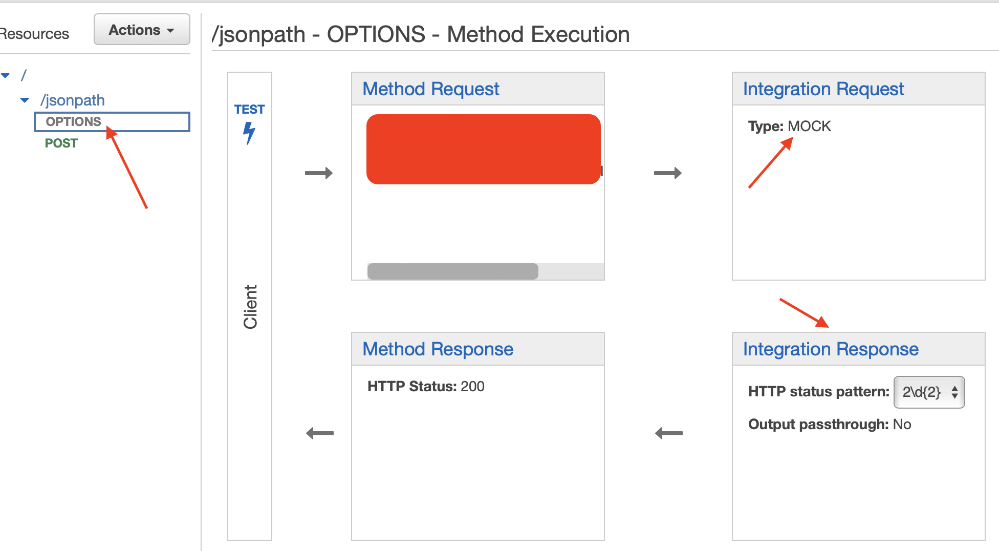
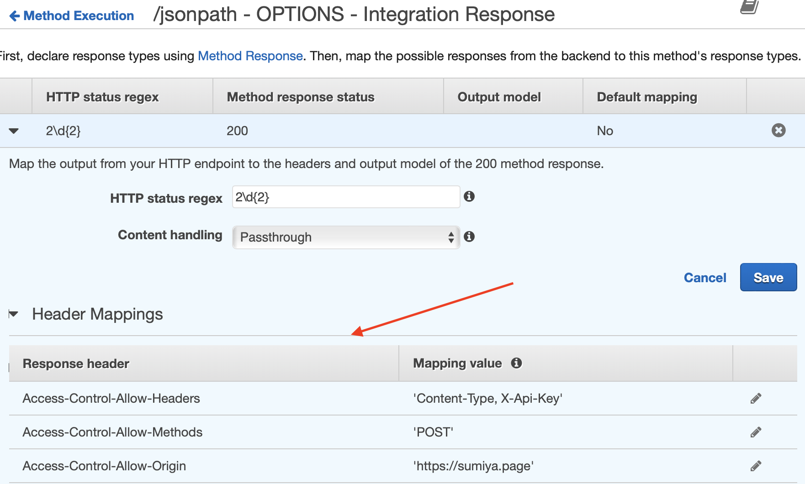

= CORS issue when submitting a POST request to a protected API

== tl; dr

When running into CORS issue with an AWS API gateway REST proxy endpoint, you must ensure that:

 * an OPTIONS method is configured at the API gateway
 * the Header Mappings are configured for the OPTIONS method Integration Response
* the proxied Lambda returns the same headers

== Setup
I created an AWS API Gateway endpoint. Then protected it with an API Key. This API gateway proxies the request to a Lambda which handles the request and returns a response.

Client -> API Gateway -> Lambda

I tested this setup through a cUrl invocation, and I was able to invoke the API successfully.

I then created a html page and tried to invoke the API with similar headers as from the cUrl.

== Issue

This ran into an error. When looking at the Network tab, I noticed the following error.

----
Access to fetch at 'https://jsonpath.sumiya.page/jsonpath' from origin 'null' has been blocked by CORS policy: Response to preflight request doesn't pass access control check: The 'Access-Control-Allow-Origin' header has a value 'https://sumiya.page' that is not equal to the supplied origin. Have the server send the header with a valid value, or, if an opaque response serves your needs, set the request's mode to 'no-cors' to fetch the resource with CORS disabled.
----

The no-cors mode works for unprotected resources. If you need to send a header, like X-Api-Key, you cannot use the no-cors mode

== Resolution

* an OPTIONS method is configured at the API gateway

* the Header Mappings are configured for the OPTIONS method Integration Response

* the proxied Lambda returns the same headers

[source, java]
----
return new APIGatewayProxyResponseEvent()
                .withBody(result)
                .withHeaders(Map.of(
                        "Access-Control-Allow-Headers", "Content-Type, X-Api-Key",
                        "Access-Control-Allow-Origin", "https://sumiya.page",
                        "Access-Control-Allow-Methods", "OPTIONS, POST"
                ))
                .withStatusCode(200);
----

NOTE: API Gateway Documentation:
https://docs.aws.amazon.com/apigateway/latest/developerguide/how-to-cors.html
