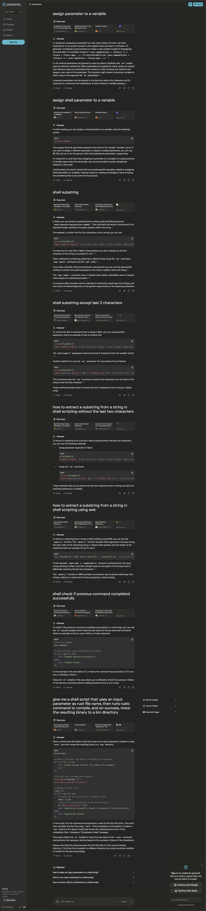

= Script to move binary generated by `rustc`

:Description: Script to move generated Rust binary code
:author: Sumiya
:nofooter:
:sectlinks:

== Tinker

One night this week, I was trying some lessons from rust by example.

The way I had structured my project, as I was creating executable files with the `rustc` command, I ended up with those executables alongside my rust source code files.

For example, the project structure looked like this after I had tried a few examples:

* hello
** hello
** hello.rs
** hello
** comments.rs
** comments
** formatted_print.rs
* primitives
** literals.rs
** literals

This clutter started bothering me as my years of writing Java have made me keep my source code and the executable separate.

Intuitively, I needed a script to run the `rustc` command to generate an executable binary and move the generated binary to a target directory.

As with Java, where you would use Maven or Gradle to structure your projects, Rust offers `cargo`. However, the idea of writing my script had already possessed me. And what kind of tinkerer would I be if I did not follow through?

== Broad Strokes

Of course, I am terrible at remembering stuff, so I need to rely heavily on the internet to help me find the correct syntax/command for different shell script steps.

I opened a new file and started thinking about what I would need.

* Create a script that does the same thing as `rustc`.
* Then, figure out how to move the generated output to a target directory.
* Use the characteristic that `rustc` generates an executable with the same name as the source file name to identify which file to move. For example, for a source code file `hello.rs`, the executable would be named `hello`.

=== Problem: How would I pass the rust file name into the script?

Search on Google: Use `$0` where 0 is the first positioned argument on the command line.
```bash
rustc $0
```

=== Next, move the generated binary to a directory/folder of my choice.

Problem: How do I set a destination directory for the output of `rustc`?

I searched Google, and almost every linked result was not what I intended to do.

== Evolution

I had been trying Perplexity for one day, and I decided to give that a try.

Here are a series of interactions I had with Perplexity.



Here is a list of queries from the above image that I tried, in order.

* assign parameter to a variable
* assign shell parameter to a variable
* shell substring
* shell substring except last 2 characters
* how to extract a substring from a string in shell scripting without the last two characters
* how to extract a substring from a string in shell scripting using awk
* shell check if previous command completed successfully
* *_give me a shell script that uses an input parameter as rust file name, then runs rustc command to compile, and on success, move the resulting binary to a bin directory_*

Within a couple of minutes, I found the right question to ask. Then, I got rewarded with a script that just worked as is.

This particular tool (Perplexity) also provided references, or cited sources, right at the start of every query result. This feature is excellent in terms of cross-checking whether you trust that source, as well as checking the content of the source.

It is also optional to sign in to use the tool.

Here is the script I ended up using: https://github.com/psumiya/learn-rust/commit/423bc5f7c46e2deac2dd2899a99cef173e2a0ee6